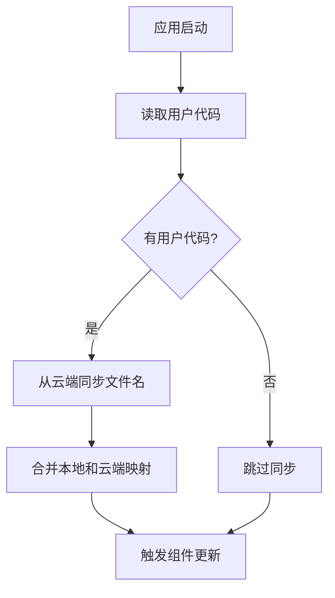
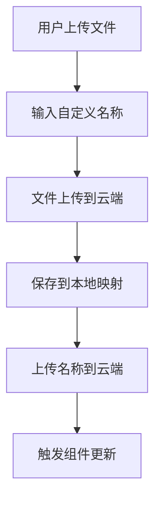
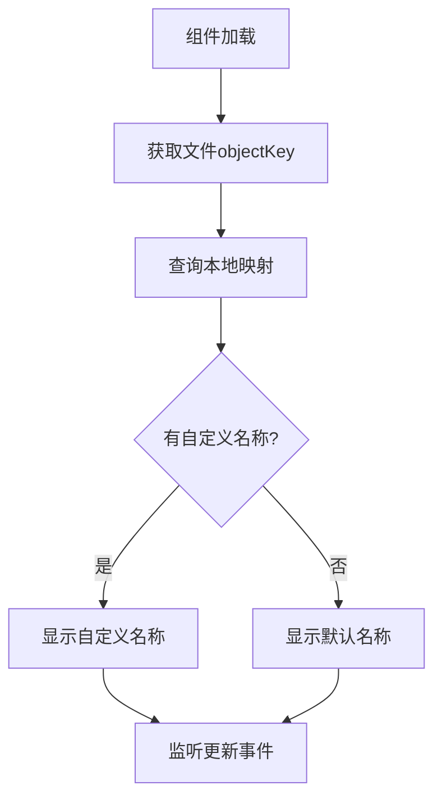

# 文件名云端同步功能

## 功能概述

实现了用户自定义文件名的云端存储和同步机制，确保用户在任何设备上都能看到一致的自定义文件名。

## 核心特性

### 🔄 自动同步
- **上传时同步**：文件上传时自动将自定义名称保存到云端
- **启动时同步**：应用启动时自动从云端同步文件名映射
- **实时更新**：文件名变化时实时通知所有相关组件更新

### ☁️ 云端存储
- **统一路径**：文件名映射存储在与文件相同的云端路径
- **版本管理**：支持文件名映射的版本控制和冲突解决
- **容错机制**：云端失败时自动降级到本地存储

### 🎯 智能合并
- **双向同步**：本地和云端文件名映射智能合并
- **冲突处理**：本地优先策略，确保用户最新操作不丢失
- **增量更新**：只同步变化的文件名映射，提高效率

## 技术架构

### 文件结构
```
src/
├── services/
│   └── fileNameCloudService.js    # 云端同步服务
├── utils/
│   └── displayName.js            # 文件名工具（已扩展）
└── App.js                        # 应用启动同步
```

### 核心服务

#### fileNameCloudService.js
- `saveCustomNamesToCloud()` - 上传文件名映射到云端
- `loadCustomNamesFromCloud()` - 从云端加载文件名映射
- `syncCustomNames()` - 智能双向同步
- `saveFileNameAfterUpload()` - 文件上传后自动保存名称

#### displayName.js (扩展)
- `setCustomNameWithCloudSync()` - 设置名称并同步到云端
- `syncCustomNamesFromCloud()` - 从云端同步到本地

### 数据格式

#### 云端存储格式
```json
{
  "customNames": {
    "recordings/user123/session456/file.mp3": "我的录音",
    "recordings/user123/session456/photo.jpg": "美好回忆"
  },
  "lastUpdated": "2024-01-01T12:00:00.000Z",
  "userCode": "user123",
  "sessionId": "global",
  "timestamp": 1704110400000,
  "version": "1.0"
}
```

#### 本地存储
- `customNames` - localStorage中的文件名映射
- `filename_cloud_info_{userCode}_{sessionId}` - 云端同步信息

## 工作流程

### 1. 应用启动


### 2. 文件上传


### 3. 名称显示


## 集成组件

### 已集成的组件
- ✅ **App.js** - 应用启动时同步
- ✅ **record.js** - 录音文件名同步
- ✅ **UploadMediaPage.js** - 媒体文件名同步
- ✅ **AudioLibrary.js** - 音频库显示同步
- ✅ **displayName.js** - 核心工具扩展

### 事件系统
```javascript
// 触发更新事件
window.dispatchEvent(new CustomEvent('customNamesUpdated', { 
  detail: { customNames: result.customNames || {} }
}));

// 监听更新事件
window.addEventListener('customNamesUpdated', handleCustomNamesUpdated);
```

## 使用方法

### 设置自定义名称（带云端同步）
```javascript
import { setCustomNameWithCloudSync } from './utils/displayName';

// 设置自定义名称并同步到云端
await setCustomNameWithCloudSync(objectKey, customName, userCode, sessionId);
```

### 应用启动时同步
```javascript
import { syncCustomNamesFromCloud } from './utils/displayName';

// 从云端同步文件名映射
const result = await syncCustomNamesFromCloud(userCode, sessionId);
```

### 监听名称更新
```javascript
useEffect(() => {
  const handleCustomNamesUpdated = (event) => {
    console.log('文件名映射已更新:', event.detail);
    // 触发组件重新渲染
    setRefreshTrigger(prev => prev + 1);
  };

  window.addEventListener('customNamesUpdated', handleCustomNamesUpdated);
  return () => window.removeEventListener('customNamesUpdated', handleCustomNamesUpdated);
}, []);
```

## 容错机制

### 云端失败处理
- 网络错误时自动降级到本地存储
- 云端服务不可用时继续使用本地映射
- 定期重试云端同步（TODO：可选实现）

### 数据一致性
- 本地优先策略：用户操作立即生效
- 云端异步同步：不阻塞用户界面
- 冲突解决：保留用户最新操作

## 测试

### 运行测试
```bash
# 启动文件名同步功能测试
./start_filename_sync_test.sh
```

### 测试步骤
1. 输入用户代码进入应用
2. 上传文件并设置自定义名称
3. 刷新页面检查云端同步
4. 在不同组件间验证一致性

## 配置

### 环境变量
```bash
REACT_APP_API_URL=https://data.tangledup-ai.com
```

### 云端路径
- 文件存储：`recordings/{userCode}/{sessionId}/`
- 名称映射：`custom_names_{userCode}_{sessionId}_latest.json`

## 性能优化

### 减少请求
- 批量上传文件名映射
- 避免重复同步相同内容
- 使用本地缓存减少云端查询

### 用户体验
- 异步操作不阻塞界面
- 实时更新响应用户操作
- 优雅的错误处理和降级

## 最新更新

### ✅ 多会话同步支持 (v1.1)

**问题**: 之前只从 'global' 会话同步文件名映射，导致录音和媒体文件的自定义名称分别保存在不同会话中，加载时只能看到部分文件名。

**解决方案**: 实现了全量会话同步机制
- 新增 `loadAllCustomNamesFromAllSessions()` - 从所有会话加载文件名映射
- 新增 `syncAllCustomNamesFromCloud()` - 统一的全量同步接口
- 更新应用启动和用户登录逻辑使用全量同步

**效果**:
- ✅ 录音文件的自定义名称现在可以正常加载
- ✅ 媒体文件的自定义名称继续正常工作
- ✅ 所有会话的文件名映射都会被合并到本地

### 🔧 技术细节

#### 同步策略优化
```javascript
// 旧版本 - 只同步单个会话
await syncCustomNamesFromCloud(userCode, 'global');

// 新版本 - 同步所有会话
await syncAllCustomNamesFromCloud(userCode);
```

#### 会话文件发现
- 自动扫描用户所有会话目录
- 识别多种文件名格式（latest、custom_names、时间戳）
- 按会话分组并选择最新的有效映射文件

## 扩展计划

### 即将实现
- [ ] 定期自动同步机制
- [ ] 文件名映射的版本历史
- [ ] 批量文件名操作
- [ ] 跨设备同步状态指示

### 长期规划
- [ ] 文件名搜索和过滤
- [ ] 智能文件名建议
- [ ] 文件名模板和规则
- [ ] 团队共享文件名映射
